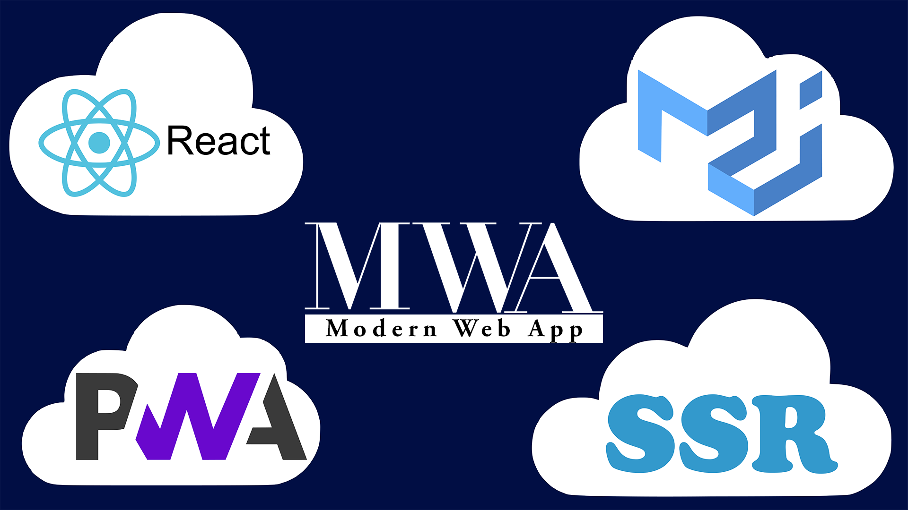

# Modern Web App

 
App is created for those who has been
searching for nice and scalable example of Progressive Web App with
Server Side Rendering and Code Splitting

Feel free to read about this app on [Medium](https://medium.com/@vanishmax/here-it-is-modern-web-app-651946efaa93)
 (English) or [Habr](https://habr.com/post/432368/) (Russian)

### Features:
* Server Side Rendering
* Progressive Web App
* Code Splitting using React-Loadable
* Prefetch
* React-router
* Simple Redux counter
* Material-ui v3 supported
* Mobile version included
* All modules are up-to-date
* All Lighthouse's tests are passed at more than 90%
* And much more

If you have some questions or just want to talk - vanishmax2018@gmail.com

### License
This project is licensed under the terms of the [MIT license](https://github.com/VanishMax/Modern-Web-App/blob/master/LICENSE)
